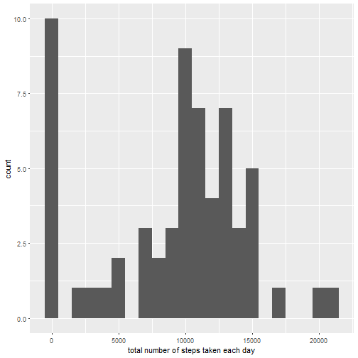
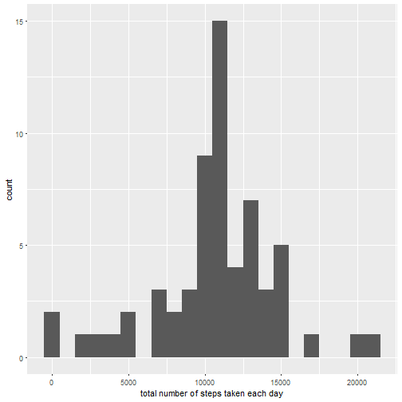
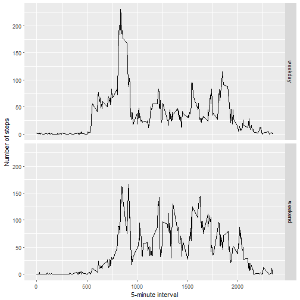

#Reproducible Research: Peer Assessment 1


```r
library(knitr)
opts_chunk$set(echo = TRUE)
```

##Loading and preprocessing the data


```r
unzip(zipfile="repdata_data_activity.zip")
data <- read.csv("activity.csv")
```

##What is mean total number of steps taken per day?


```r
library(ggplot2)
total.steps <- tapply(data$steps, data$date, FUN=sum, na.rm=TRUE)
qplot(total.steps, binwidth=1000, xlab="total number of steps taken each day")
```



```r
mean(total.steps, na.rm=TRUE)
```

```
## [1] 9354.23
```

```r
median(total.steps, na.rm=TRUE)
```

```
## [1] 10395
```

##What is average daily activity pattern?


```r
averages <- aggregate(x=list(steps=data$steps), by=list(interval=data$interval),
                      FUN=mean, na.rm=TRUE)
ggplot(data=averages, aes(x=interval, y=steps)) +
    geom_line() +
    xlab("5-minute interval") +
    ylab("average number of steps taken")
```


Which 5-minute interval, on average across all the days in the dataset, contains the maximum number of steps?


```r
averages[which.max(averages$steps),]
```

```
##     interval    steps
## 104      835 206.1698
```

##Imputing missing values

Note that there are a number of days/intervals where there are missing values (coded as NA). The presence of missing days may introduce bias into some calculations or summaries of the data.


```r
missing <- is.na(data$steps)
table(missing)
```

```
## missing
## FALSE  TRUE 
## 15264  2304
```

All of the missing values are filled in with mean value for that 5-minute interval.


```r
# Replace each missing value with the mean value of its 5-minute interval
fill.value <- function(steps, interval) {
    filled <- NA
    if (!is.na(steps))
        filled <- c(steps)
    else
        filled <- (averages[averages$interval==interval, "steps"])
    return(filled)
}
filled.data <- data
filled.data$steps <- mapply(fill.value, filled.data$steps, filled.data$interval)
```

Now, using the filled data set, let's make a histogram of the total number of steps taken each day and calculate the mean and median total number of steps.


```r
total.steps <- tapply(filled.data$steps, filled.data$date, FUN=sum)
qplot(total.steps, binwidth=1000, xlab="total number of steps taken each day")
```



```r
mean(total.steps)
```

```
## [1] 10766.19
```

```r
median(total.steps)
```

```
## [1] 10766.19
```

After imputing missing data, Mean and median values are higher. The difference is due to that there are some days with steps values NA for any interval. After replacing missing steps values with the mean steps of associated interval value, these 0 values are replaced with the mean value of the interval.

##Are there differences in activity patterns between weekdays and weekends?

First, let's find the day of week for each measurement using the dataset with filled-in values.


```r
weekday.or.weekend <- function(date) {
    day <- weekdays(date)
    if (day %in% c("Monday", "Tuesday", "Wednesday", "Thursday", "Friday"))
        return("weekday")
    else if (day %in% c("Saturday", "Sunday"))
        return("weekend")
    else
        stop("invalid date")
}
filled.data$date <- as.Date(filled.data$date)
filled.data$day <- sapply(filled.data$date, FUN=weekday.or.weekend)
```

Now, let's make a panel plot containing plots of average number of steps taken on weekdays and weekends.


```r
averages <- aggregate(steps ~ interval + day, data=filled.data, mean)
ggplot(averages, aes(interval, steps)) + geom_line() + facet_grid(day ~ .) +
    xlab("5-minute interval") + ylab("Number of steps")
```




